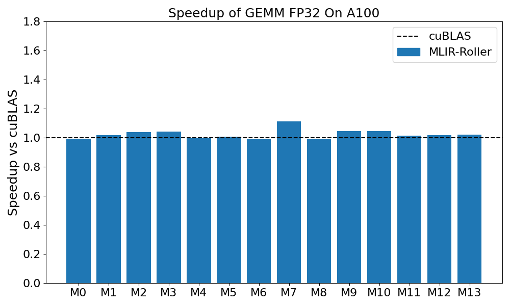

# MLIR Roller
A reimplementation of OSDI'22 "Roller: Fast and Efficient Tensor Compilation for Deep Learning".

# Benchmark Summary
- Matmul Performance on A100

  

    
  

# Matrix shapes in benchmark
| | M0 | M1 | M2 | M3 | M4 | M5 | M6 | M7 | M8 | M9 | M10 | M11 | M12 | M13 |
|:---:| :---: | :---: | :---: | :---: | :---: | :---: | :---: | :---: | :---: | :---: | :---: | :---: | :---: | :---: |
| M | 2048 | 2048 | 2048 | 2048 | 2048 | 2048 | 2048 | 4096 | 4096 | 4096 | 4096 | 8192 | 8192 | 8192 |
| N | 2048 | 2048 | 4096 | 4096 | 8192 | 8192 | 8192 | 2048 | 4096 | 8192 | 8192 | 2048 | 4096 | 4096 |
| K | 2048 | 8192 | 2048 | 4096 | 2048 | 4096 | 8192 | 2048 | 8192 | 2048 | 4096 | 8192 | 2048 | 4096 |
